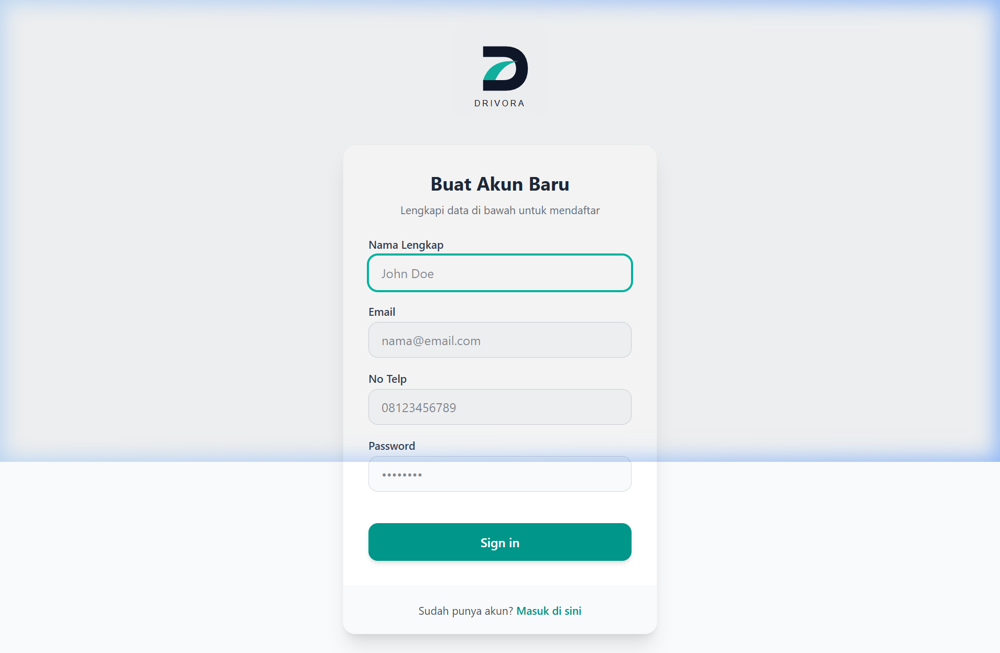
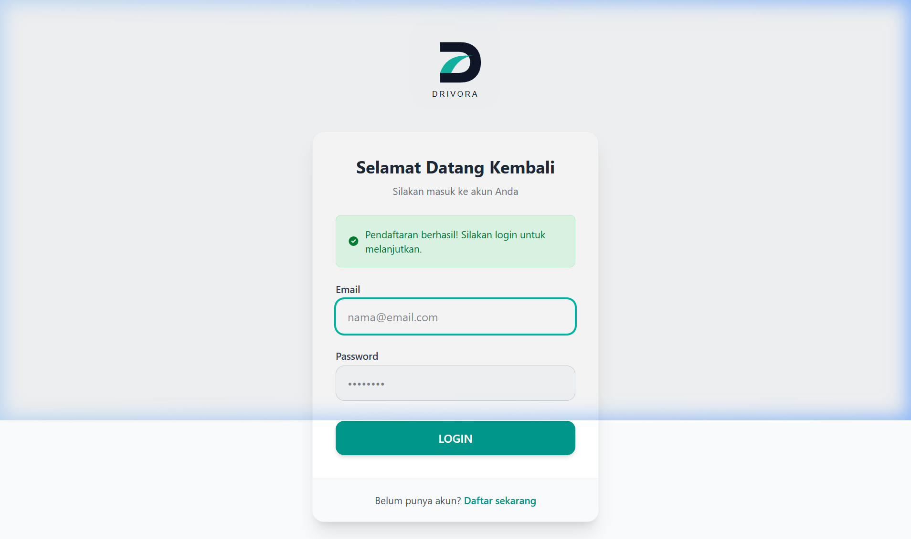
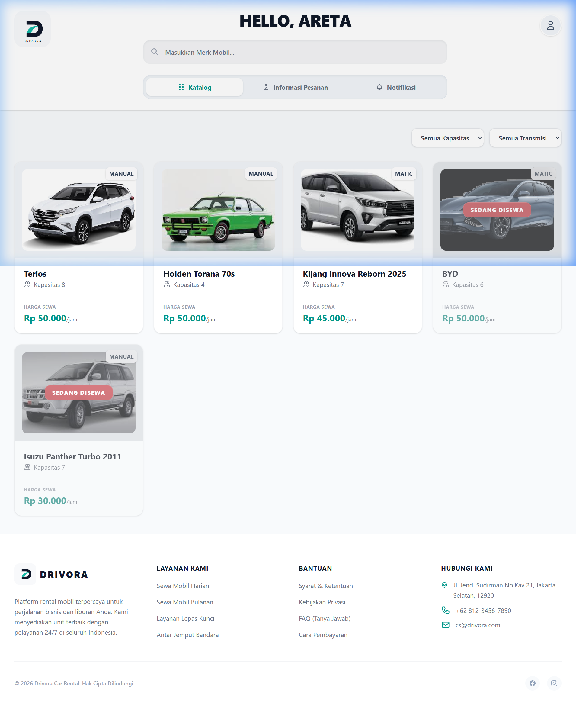
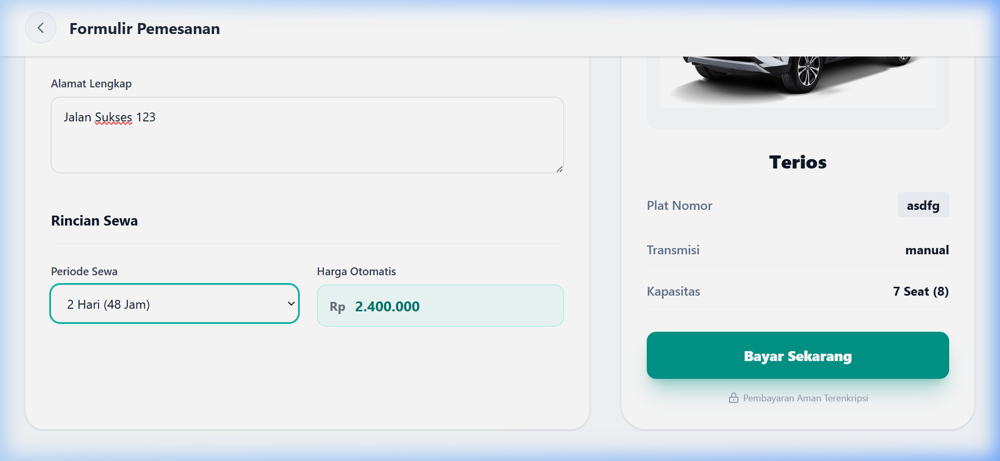
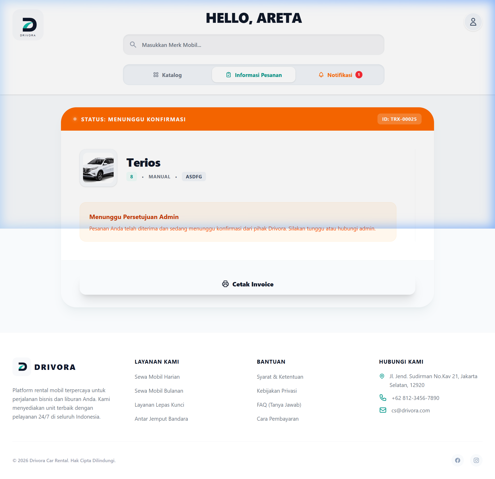
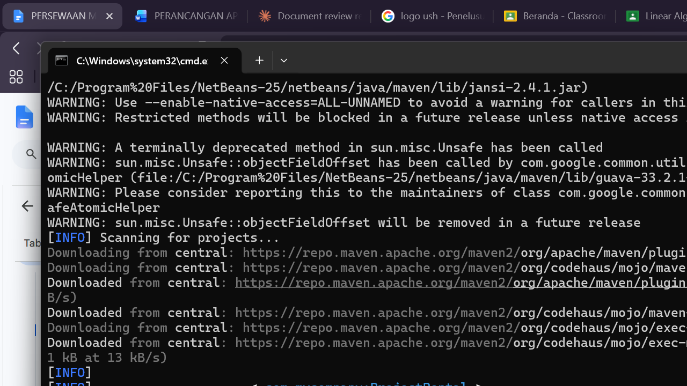

# 🚗 Panduan Penggunaan Lengkap (User Guide) - Drivora

Selamat datang di Panduan Penggunaan Lengkap Platform **Drivora**. Dokumen ini dirancang dengan format *dropdown* (dapat diklik untuk membuka/menutup bagian) untuk memudahkan navigasi. Panduan ini menjelaskan alur operasional sistem secara menyeluruh dari sisi **Customer (Web Laravel)** hingga **Admin (Aplikasi Java Swing Desktop)**.

---

## 📸 Petunjuk Pemasangan Gambar (Screenshots)
> [!IMPORTANT]
> Untuk menampilkan gambar/screenshot asli di dalam dokumen ini, silakan ambil screenshot dari aplikasi Anda, beri nama file sesuai petunjuk masing-masing bagian, lalu simpan file gambar tersebut di folder:
> `docs/screenshots/` (silakan buat folder `docs/screenshots` di root folder proyek ini jika belum ada).

---

## 👤 Bagian 1: Panduan Penggunaan Sisi Customer (Web Laravel)

Di bawah ini adalah panduan lengkap bagi customer untuk mencari mobil, melakukan pemesanan, memantau status sewa, hingga mengajukan perpanjangan sewa melalui web browser.

<b>1. Registrasi Akun dan Login Customer</b>

### Langkah-langkah:
1. Buka browser dan akses alamat web Drivora (default: `http://localhost:8000`).
2. Klik tombol **Register** pada pojok kanan atas untuk membuat akun baru. Isi Nama Lengkap, Email, Password, Nomor HP, Alamat, dan NIK secara valid.
3. Setelah berhasil mendaftar, Anda akan dialihkan ke halaman **Login**. Masukkan Email dan Password yang telah didaftarkan.
4. Klik tombol **Login** untuk masuk ke dashboard utama customer.

---
### Tampilan Layar:
#### A. Halaman Registrasi

*(Simpan screenshot form register Anda di: `docs/screenshots/customer_register.png`)*

#### B. Halaman Login

*(Simpan screenshot form login Anda di: `docs/screenshots/customer_login.png`)*

<b>2. Jelajah Katalog Mobil & Cari Unit</b>

### Langkah-langkah:
1. Setelah login berhasil, Anda akan masuk ke halaman **Catalog/Katalog Mobil**.
2. Anda akan melihat daftar unit mobil yang siap disewa, lengkap dengan gambar, spesifikasi transmisi, dan harga sewa per jam.
3. Gunakan kolom pencarian di bagian atas jika ingin mencari merk mobil tertentu (contoh: "BYD", "Terios").
4. Mobil yang sedang disewa oleh orang lain akan bertuliskan status **"Rented"** atau disembunyikan dari daftar aktif, sehingga Anda hanya bisa memesan unit dengan status **"Available"**.

---
### Tampilan Layar:
#### Katalog & Pencarian Mobil

*(Simpan screenshot katalog Anda di: `docs/screenshots/customer_catalog.png`)*

<b>3. Proses Booking / Checkout Sewa</b>

### Langkah-langkah:
1. Pada mobil pilihan Anda yang berstatus *Available*, klik tombol **Sewa Sekarang / Book Now**.
2. Anda akan diarahkan ke form pemesanan:
   - Tentukan **Waktu Mulai (Start Time)** sewa.
   - Tentukan **Waktu Selesai (End Time)** sewa.
3. Sistem Laravel akan menghitung durasi sewa secara otomatis dalam jam dan mengalikan dengan tarif per jam untuk menampilkan **Total Price** secara real-time.
4. Periksa kembali ringkasan pesanan, lalu klik **Konfirmasi Sewa / Submit Booking**.
5. Status pesanan Anda pertama kali akan diatur menjadi **"Pending"** (Menunggu Verifikasi Dokumen oleh Admin).

---
### Tampilan Layar:
#### Form Booking & Kalkulasi Harga

*(Simpan screenshot form booking Anda di: `docs/screenshots/customer_booking.png`)*

<b>4. Dashboard Customer & Pemantauan Status</b>

### Langkah-langkah:
1. Setelah mengajukan booking, klik menu **Dashboard** di bagian navigasi atas.
2. Di sini Anda dapat memantau status pesanan aktif Anda:
   - **Pending**: Pesanan baru dibuat, menunggu verifikasi identitas (KTP) dan persetujuan Admin di aplikasi Java.
   - **Active**: Pesanan telah disetujui Admin, mobil siap digunakan atau sedang dalam masa sewa.
   - **Rejected**: Pesanan ditolak oleh Admin (disertai alasan penolakan yang diinput oleh Admin).
3. Jika status sewa Anda sudah **Active**, layar dashboard akan menampilkan *countdown timer* (sisa waktu sewa) dan tombol untuk melakukan perpanjangan.

---
### Tampilan Layar:
#### Halaman Dashboard Customer

*(Simpan screenshot dashboard Anda di: `docs/screenshots/customer_dashboard.png`)*

<b>5. Mengajukan Perpanjangan Sewa (Extend Unit)</b>

### Langkah-langkah:
1. Jika masa sewa Anda masih aktif dan ingin memperpanjang waktu penggunaan mobil, masuk ke **Dashboard Customer**.
2. Temukan pesanan aktif Anda lalu klik tombol **Perpanjang / Extend**.
3. Masukkan jumlah hari perpanjangan yang Anda inginkan (misal: 1 Hari, 2 Hari).
4. Sistem akan menampilkan biaya tambahan berdasarkan rumus: `tarif_per_jam * 24 jam * jumlah_hari`.
5. Klik **Ajukan Perpanjangan**. Status perpanjangan Anda akan berubah menjadi **"Pending Verification"**.
6. Anda harus menunggu Admin memverifikasi pembayaran/permohonan perpanjangan tersebut dari aplikasi desktop Java. Setelah disetujui, tanggal selesai sewa Anda otomatis bertambah di dashboard.

---
### Tampilan Layar:
#### Pop-up Form Perpanjangan Sewa

*(Simpan screenshot pengajuan extend Anda di: `docs/screenshots/customer_extend.png`)*

---

## 💻 Bagian 2: Panduan Penggunaan Sisi Admin (Aplikasi Java Swing Desktop)

Bagian ini menjelaskan cara operasional Admin Drivora menggunakan aplikasi desktop berbasis Java Swing untuk memproses verifikasi, pengembalian, dan denda.

<b>1. Login Admin Desktop</b>

### Langkah-langkah:
1. Jalankan aplikasi Java Swing Drivora di komputer admin.
2. Masukkan Username/Email Admin dan Password Admin yang terdaftar di database.
3. Klik tombol **Login**.
4. Jika berhasil, Anda akan diarahkan masuk ke halaman Dashboard Utama Admin.

---
### Tampilan Layar:
#### Form Login Admin Java

*(Simpan screenshot login admin Anda di: `docs/screenshots/admin_login.png`)*

<b>2. Dashboard Utama Admin & Statistik</b>

### Langkah-langkah:
1. Setelah login, Anda berada di tab **Dashboard**.
2. Anda akan disambut dengan teks dinamis `"HELLO, ADMIN [Nama Admin]"` di bagian tengah atas halaman.
3. Di sini terdapat statistik ringkasan operasional:
   - Jumlah mobil yang tersedia (*Available Cars*).
   - Jumlah mobil yang sedang disewa (*Rented Cars*).
   - Total transaksi atau keuntungan (*Revenue*).
4. Navigasi menu utama terletak di sisi sidebar kiri untuk berpindah menu dengan mudah.

---
### Tampilan Layar:
#### Dashboard Admin Java

*(Simpan screenshot dashboard admin Anda di: `docs/screenshots/admin_dashboard.png`)*

<b>3. Menu Master Data (Kelola Armada Mobil)</b>

### Langkah-langkah:
1. Klik menu **Master Data** di sidebar kiri.
2. Di halaman ini, Admin dapat mengelola unit mobil rental:
   - **Tambah Mobil**: Masukkan nama merk, tipe transmisi (Automatic/Manual), plat nomor, harga sewa per jam, dan upload foto mobil.
   - **Edit Mobil**: Pilih baris mobil di tabel, edit informasi yang ingin diganti, lalu klik simpan/update.
   - **Hapus Mobil**: Pilih unit mobil lalu klik hapus untuk mengeluarkan dari sistem.
3. Gunakan kolom pencarian di bagian tengah atas untuk menyaring data mobil berdasarkan merk dengan cepat.

---
### Tampilan Layar:
#### Halaman Master Data Mobil

*(Simpan screenshot master data Anda di: `docs/screenshots/admin_master_data.png`)*

<b>4. Menu Order (Verifikasi Sewa Baru & Perpanjangan Sewa)</b>

### Langkah-langkah:
1. Klik menu **Order** di sidebar kiri.
2. Halaman ini memiliki sistem **Unified Order List** di bagian kiri yang menampung dua jenis transaksi tertunda:
   - **Sewa Baru**: Pesanan baru masuk dengan ikon mobil 🚗 (latar belakang putih).
   - **Perpanjangan Sewa (Extend)**: Pesanan perpanjangan aktif dengan ikon jam pasir ⏳ (latar belakang biru muda).
3. Klik salah satu item pesanan untuk melihat detail data pemesan di panel sebelah kanan:
   - **Jika Sewa Baru**: Isi formulir Nama KTP, Alamat, NIK, dan klik **Upload KTP** (unggah foto fisik KTP pelanggan), kemudian klik **Konfirmasi** untuk menyetujui, atau **Tolak** untuk membatalkan sewa baru.
   - **Jika Perpanjangan Sewa**: Tombol KTP otomatis di-disable karena data KTP sudah terverifikasi sebelumnya. Nominal yang tertera adalah biaya perpanjangan hari. Klik **Konfirmasi** untuk memperpanjang waktu sewa pelanggan di database secara langsung, atau **Tolak** untuk menolak pengajuan perpanjangan.

---
### Tampilan Layar:
#### A. Detail Verifikasi Sewa Baru

*(Simpan screenshot verifikasi sewa baru di: `docs/screenshots/admin_verify_new.png`)*

#### B. Detail Verifikasi Perpanjangan (Extend)

*(Simpan screenshot verifikasi perpanjangan di: `docs/screenshots/admin_verify_extend.png`)*

<b>5. Menu Return (Proses Pengembalian Mobil & Denda Keterlambatan)</b>

### Langkah-langkah:
1. Klik menu **Return** di sidebar kiri jika pelanggan mengembalikan mobil ke garasi.
2. Di sebelah kiri, pilih mobil/rental aktif yang sedang dikembalikan oleh pelanggan.
3. Sistem akan menghitung waktu pengembalian secara real-time terhadap batas waktu sewa:
   - **Tepat Waktu (Hijau)**: Sisa waktu ditunjukkan dengan label hijau. Total pembayaran bernilai normal.
   - **Terlambat / Overdue (Merah)**: Jika batas sewa terlewati, label waktu menjadi merah dan latar belakang card menjadi kemerahan. Sistem akan secara otomatis menghitung nominal denda keterlambatan (`penaltyAmount`) secara real-time.
4. Klik **Konfirmasi Pengembalian**:
   - Status rental berubah menjadi **"Completed"**.
   - Status mobil kembali menjadi **"Available"** di database.
   - **Jika Terlambat**: Logika Java otomatis akan mencatat rincian denda ke tabel **`penalties`** (durasi keterlambatan dalam jam dan total nominal denda) dan memasukkan transaksi keuangan tipe `'Denda'` ke tabel `transactions` untuk sinkronisasi laporan keuangan yang komprehensif dengan Laravel.

---
### Tampilan Layar:
#### A. Detail Pengembalian Tepat Waktu

*(Simpan screenshot pengembalian normal di: `docs/screenshots/admin_return_normal.png`)*

#### B. Detail Pengembalian Terlambat (Perhitungan Denda)

*(Simpan screenshot pengembalian telat di: `docs/screenshots/admin_return_overdue.png`)*

---

## 🛠️ Ringkasan Alur Sinkronisasi Data (Java ↔️ Laravel)
Platform Drivora dibangun dengan arsitektur database terintegrasi sehingga aksi di satu platform langsung berdampak pada platform lainnya secara real-time:
* **Booking Sewa** dilakukan pelanggan via Web Laravel $\rightarrow$ muncul secara instan di menu **Order** Java Swing Admin.
* **Persetujuan Sewa / Pengunggahan KTP** oleh Admin di Java Swing $\rightarrow$ status sewa berubah menjadi **Active** di Web Laravel pelanggan.
* **Pengajuan Perpanjangan** diajukan pelanggan via Web Laravel $\rightarrow$ muncul dengan highlight biru muda ⏳ di menu **Order** Java Swing Admin untuk segera diverifikasi.
* **Proses Pengembalian / Perhitungan Denda** dikonfirmasi Admin di Java Swing $\rightarrow$ data masuk ke tabel `penalties` dan `transactions` secara otomatis, sehingga riwayat transaksi pelanggan di Web Laravel langsung terupdate secara konsisten.
