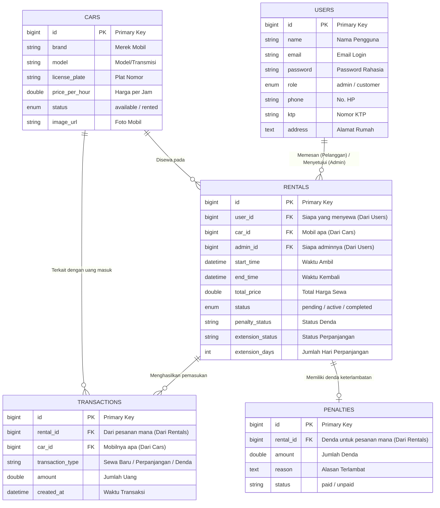

# 📊 Dokumentasi Database: ERD dan LRS

File ini berisi gambaran struktur database inti yang kita gunakan pada proyek Rental Mobil (Drivora). Anda bisa menggunakan rancangan ini untuk dimasukkan ke dalam laporan makalah UAS Anda.

---

## 1. ERD (Entity Relationship Diagram)
ERD menggambarkan bagaimana setiap tabel (entitas) saling berhubungan di dunia nyata.

---

## 2. LRS (Logical Record Structure)
LRS menggambarkan pemetaan fisik relasi antar *tabel* melalui *Primary Key* (PK) dan *Foreign Key* (FK).

### Relasi Tabel:

1. **USERS (1) ---- (M) RENTALS**
   - **Artinya:** Satu *User* (Pelanggan) bisa melakukan banyak pemesanan (*Rentals*). Satu *User* (Admin) bisa mengurus banyak pesanan.
   - **Kunci:** `USERS.id` saling terhubung dengan `RENTALS.user_id` dan `RENTALS.admin_id`.

2. **CARS (1) ---- (M) RENTALS**
   - **Artinya:** Satu mobil di *Cars* bisa memiliki banyak riwayat penyewaan di tabel *Rentals* dari waktu ke waktu.
   - **Kunci:** `CARS.id` saling terhubung dengan `RENTALS.car_id`.

3. **RENTALS (1) ---- (M) TRANSACTIONS**
   - **Artinya:** Satu kode pesanan di *Rentals* bisa memiliki banyak catatan uang masuk di tabel *Transactions* (misal: bayar sewa di awal, lalu bayar perpanjangan di hari lain, lalu bayar denda).
   - **Kunci:** `RENTALS.id` saling terhubung dengan `TRANSACTIONS.rental_id`.

4. **CARS (1) ---- (M) TRANSACTIONS**
   - **Artinya:** Satu mobil dapat mendatangkan banyak transaksi pendapatan. (Relasi ini dipakai Admin Java untuk mempercepat pembuatan laporan *Income Sheet*).
   - **Kunci:** `CARS.id` saling terhubung dengan `TRANSACTIONS.car_id`.

5. **RENTALS (1) ---- (1/M) PENALTIES**
   - **Artinya:** Satu pesanan sewa memiliki maksimal satu buah catatan denda keterlambatan (jika pelanggan telat mengembalikan).
   - **Kunci:** `RENTALS.id` saling terhubung dengan `PENALTIES.rental_id`.

### Skema Basis Data (Metadata)
*(Dapat disalin langsung ke makalah Anda)*
- **Tabel USERS**: `[PK_id]`, `name`, `email`, `password`, `role`, `phone`, `ktp`, `address`, `timestamps`
- **Tabel CARS**: `[PK_id]`, `brand`, `model`, `license_plate`, `price_per_hour`, `status`, `image_url`, `timestamps`
- **Tabel RENTALS**: `[PK_id]`, `[FK_user_id]`, `[FK_car_id]`, `[FK_admin_id]`, `start_time`, `end_time`, `total_price`, `status`, `penalty_status`, `extension_status`, `extension_days`, `notification_dismissed`, `rejection_reason`, `timestamps`
- **Tabel TRANSACTIONS**: `[PK_id]`, `[FK_rental_id]`, `[FK_car_id]`, `transaction_type`, `amount`, `timestamps`
- **Tabel PENALTIES**: `[PK_id]`, `[FK_rental_id]`, `amount`, `reason`, `status`, `timestamps`
