# PANDUAN PENGGUNA (USER GUIDE) - DRIVORA RENTAL SYSTEM
**Versi:** 1.0  
**Tanggal:** 29 Juni 2026  
**Sistem:** Web Laravel (Customer) & Java Swing (Admin Desktop)

---

## DAFTAR ISI
1. [Pendahuluan](#1-pendahuluan)
2. [Arsitektur Sistem](#2-arsitektur-sistem)
3. [Prasyarat Instalasi](#3-prasyarat-instalasi)
4. [Panduan Web Laravel (Customer)](#4-panduan-web-laravel-customer)
5. [Panduan Java Swing (Admin Desktop)](#5-panduan-java-swing-admin-desktop)
6. [Alur Integrasi Web ↔ Desktop](#6-alur-integrasi-web--desktop)

---

## 1. PENDAHULUAN

**Drivora** adalah sistem rental mobil terintegrasi yang terdiri dari dua aplikasi:
- **Website Laravel** — Digunakan oleh **customer** untuk melihat katalog, memesan, membayar sewa, dan memperpanjang durasi sewa mobil.
- **Aplikasi Desktop Java Swing** — Digunakan oleh **admin** untuk mengelola armada mobil, mengonfirmasi pesanan masuk, memproses pengembalian & denda, serta memantau laporan pemasukan.

Kedua aplikasi terhubung ke **satu database MySQL** yang sama (`db_drivora`), sehingga perubahan data di satu sisi langsung terlihat di sisi lainnya secara real-time.

---

## 2. ARSITEKTUR SISTEM

```
┌─────────────────────┐         ┌──────────────┐         ┌─────────────────────────┐
│   Website Laravel   │         │              │         │  Java Swing Desktop App │
│   (Customer Side)   │◄───────►│  MySQL DB    │◄───────►│    (Admin Side)          │
│   Port: 8000/8001   │         │  db_drivora  │         │    NetBeans IDE          │
└─────────────────────┘         └──────────────┘         └─────────────────────────┘
```

---

## 3. PRASYARAT INSTALASI

### 3.1 Untuk Web Laravel
| Komponen | Versi Minimum | Keterangan |
|----------|---------------|------------|
| PHP | 8.2+ | Pastikan sudah ada di PATH |
| Composer | 2.x | Package manager PHP |
| MySQL/XAMPP | 8.0+ | Database server |
| Node.js | 18+ | Untuk kompilasi asset Vite |

### 3.2 Untuk Java Swing Desktop
| Komponen | Versi Minimum | Keterangan |
|----------|---------------|------------|
| JDK | 17+ | Java Development Kit |
| NetBeans IDE | 17+ | IDE utama untuk menjalankan proyek |
| MySQL Connector/J | 8.3.0 | Driver JDBC (sudah tersedia di `lib/`) |
| XAMPP/MySQL | 8.0+ | Database server yang sama |

### 3.3 Setup Database
1. Nyalakan **XAMPP** → Aktifkan **Apache** dan **MySQL**.
2. Buka **phpMyAdmin** (`http://localhost/phpmyadmin`).
3. Buat database baru bernama `db_drivora`.
4. Jalankan migrasi Laravel:
   ```bash
   cd rental-mobil
   php artisan migrate
   ```

### 3.4 Menjalankan Web Laravel
```bash
cd rental-mobil
composer install
npm install
php artisan serve
```
Website akan berjalan di `http://127.0.0.1:8000`.

### 3.5 Menjalankan Java Swing
1. Buka folder `projectrentalgit` menggunakan **NetBeans IDE**.
2. Klik kanan proyek → **"Resolve Problems"** jika ada dependensi yang belum terhubung.
3. Tekan **F6** atau klik **Run Project** untuk menjalankan aplikasi.

---

## 4. PANDUAN WEB LARAVEL (CUSTOMER)

### 4.1 Registrasi Akun Baru

**Langkah-langkah:**
1. Buka browser, akses `http://127.0.0.1:8000/register`.
2. Isi formulir pendaftaran:
   - **Nama Lengkap**: Nama asli Anda.
   - **Email**: Alamat email aktif (harus unik, belum terdaftar).
   - **No Telp**: Nomor telepon yang dapat dihubungi.
   - **Password**: Minimal 6 karakter.
3. Klik tombol **"Sign in"** (tombol hijau di bawah form).
4. Jika berhasil, Anda akan dialihkan ke halaman **Login** dengan notifikasi hijau *"Pendaftaran berhasil!"*.

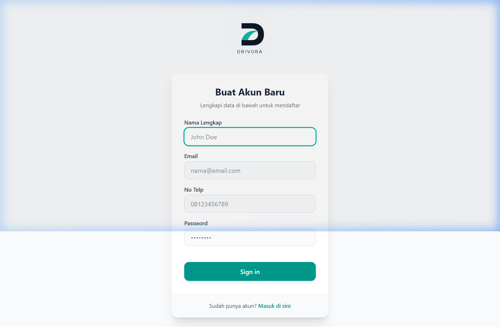

> **Catatan:** Jika email sudah terdaftar, akan muncul pesan error *"Email ini sudah terdaftar."*

---

### 4.2 Login ke Akun

**Langkah-langkah:**
1. Buka `http://127.0.0.1:8000/login`.
2. Masukkan **Email** dan **Password** yang sudah didaftarkan.
3. Klik tombol **"LOGIN"** (tombol hijau).
4. Jika berhasil, Anda akan dialihkan ke halaman **Dashboard**.

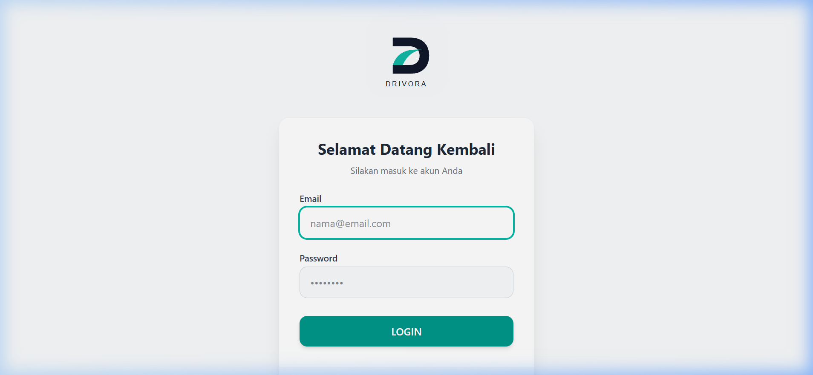

> **Catatan:** Jika password salah, muncul pesan *"Kombinasi email dan password salah."*

---

### 4.3 Melihat Katalog Mobil

**Langkah-langkah:**
1. Setelah login, Anda otomatis berada di halaman katalog (`/cars`).
2. Di halaman ini Anda dapat melihat seluruh armada mobil yang tersedia.
3. Gunakan fitur filter di pojok kanan atas:
   - **Dropdown "Semua Kapasitas"** — Filter berdasarkan jumlah kursi (4/5/6/7 Seat).
   - **Dropdown "Semua Transmisi"** — Filter berdasarkan Manual atau Automatic.
4. Gunakan **kotak pencarian** di atas untuk mencari berdasarkan nama/merk mobil.
5. Mobil berstatus **"SEDANG DISEWA"** ditampilkan dengan warna abu-abu dan tidak bisa diklik.

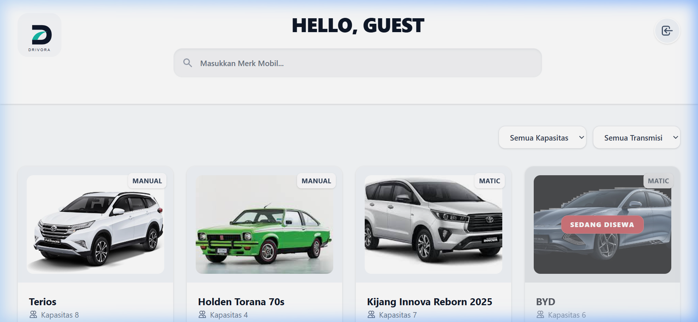

---

### 4.4 Melihat Detail & Spesifikasi Mobil

**Langkah-langkah:**
1. Pada halaman katalog, klik salah satu **kartu mobil** yang berstatus tersedia (bukan "Sedang Disewa").
2. Halaman detail menampilkan:
   - Foto mobil ukuran besar.
   - **Harga sewa per jam** (dalam Rupiah).
   - **Transmisi** (Manual/Automatic) dan **Kapasitas** (jumlah seat).
   - **Deskripsi kendaraan** lengkap.
3. Untuk memesan, klik tombol hijau **"Pesan Unit Sekarang"**.
4. Untuk bertanya ke admin, klik tombol **"Hubungi Admin"**.

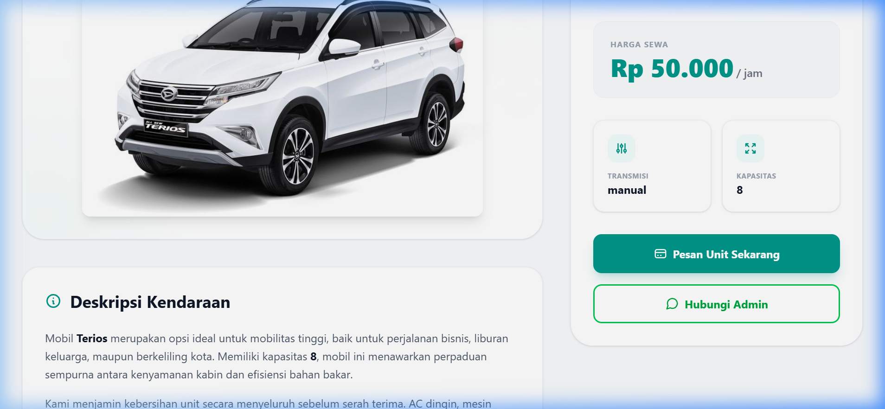

---

### 4.5 Mengisi Formulir Pemesanan Sewa

**Langkah-langkah:**
1. Setelah mengeklik "Pesan Unit Sekarang", Anda akan masuk ke **Formulir Pemesanan**.
2. Isi data pada bagian **"Data Diri & Pengiriman"**:
   - **Nama Lengkap** — Terisi otomatis dari data akun.
   - **Nomor Telepon** — Pastikan nomor aktif.
   - **Nomor KTP** — Masukkan 16 digit NIK.
   - **Alamat Lengkap** — Alamat domisili saat ini.
3. Pada bagian **"Rincian Sewa"**:
   - Pilih **Periode Sewa** dari dropdown (1 Hari, 2 Hari, ..., 7 Hari).
   - **Harga Otomatis** akan dihitung secara real-time.
   - **Promo khusus**: Jika memilih durasi **7 Hari**, harga otomatis mendapat **diskon 15%**.
4. Di panel kanan, Anda bisa melihat **Ringkasan Unit** (foto, plat nomor, transmisi, kapasitas).
5. Klik tombol hijau **"Bayar Sekarang"** untuk melanjutkan ke halaman pembayaran.

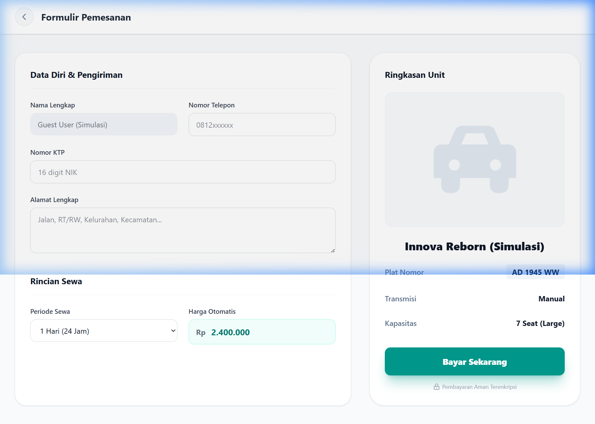

---

### 4.6 Dashboard Customer

**Langkah-langkah:**
1. Akses dashboard melalui menu navigasi atau langsung ke `/dashboard`.
2. Dashboard menampilkan:
   - **Status sewa aktif** — Jika ada pesanan yang sedang berjalan.
   - **Countdown sisa waktu** — Timer mundur durasi sewa Anda.
   - **Tombol Perpanjangan** — Untuk memperpanjang durasi sewa.
   - **Notifikasi Denda** — Jika waktu sewa telah habis dan Anda belum mengembalikan mobil.
3. Jika belum memiliki pesanan aktif, dashboard akan menampilkan pesan *"Belum Ada Pesanan Aktif"* dengan tombol **"Sewa Mobil Sekarang"**.

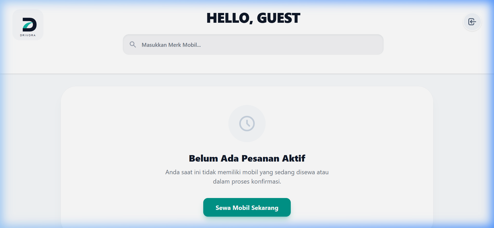

---

## 5. PANDUAN JAVA SWING (ADMIN DESKTOP)

> **Catatan:** Screenshot di bawah menjelaskan antarmuka admin berdasarkan kode sumber Java Swing. Untuk mendapatkan tampilan visual langsung, jalankan proyek `projectrentalgit` menggunakan NetBeans IDE (tekan F6).

### 5.1 Login Admin

**Langkah-langkah:**
1. Jalankan aplikasi dari NetBeans (F6). Form **Login** akan muncul pertama kali.
2. Masukkan:
   - **Email** — Email admin yang sudah terdaftar di database.
   - **Password** — Kata sandi akun admin.
3. Klik tombol **"Login"**.
4. Sistem akan memverifikasi password menggunakan **BCrypt hash matching**.
5. Jika berhasil, muncul popup *"Login Berhasil!"* dan jendela **Dashboard Admin** akan terbuka.

> **Penting:** Hanya akun dengan role `'admin'` yang dapat masuk. Akun customer tidak bisa login melalui aplikasi desktop ini.

---

### 5.2 Registrasi Admin Baru

**Langkah-langkah:**
1. Pada form Login, klik link **"Belum punya akun? Daftar di sini"**.
2. Isi formulir:
   - **Nama**, **Email**, **No Telepon**, **Password**.
3. Klik tombol **"Register"**.
4. Sistem akan:
   - Memvalidasi format email (harus mengandung `@` dan `.`).
   - Memeriksa apakah email sudah terdaftar di database.
   - Meng-hash password menggunakan **BCrypt** sebelum menyimpan.
5. Jika sukses, muncul popup *"Registrasi Berhasil!"* dan dialihkan ke form Login.

---

### 5.3 Dashboard Admin (Navigasi Utama)

Setelah login, Anda akan melihat **Dashboard Admin** dengan navigasi sidebar di sisi kiri:

| Menu Sidebar | Fungsi |
|-------------|--------|
| **Masterdata** | Melihat katalog semua armada mobil dalam format kartu visual |
| **Order** | Melihat dan mengonfirmasi pesanan sewa masuk dari customer |
| **Return** | Memproses pengembalian mobil dan verifikasi denda |
| **Income** | Melihat laporan pemasukan dan detail invoice transaksi |
| **Tambah Unit** | Menambahkan unit mobil baru ke armada |
| **Hapus Unit** | Menghapus unit mobil yang sudah tidak digunakan |

Admin dapat berpindah antar menu dengan mengeklik item di sidebar. Konten di area utama akan berubah sesuai menu yang dipilih (menggunakan sistem **CardLayout**).

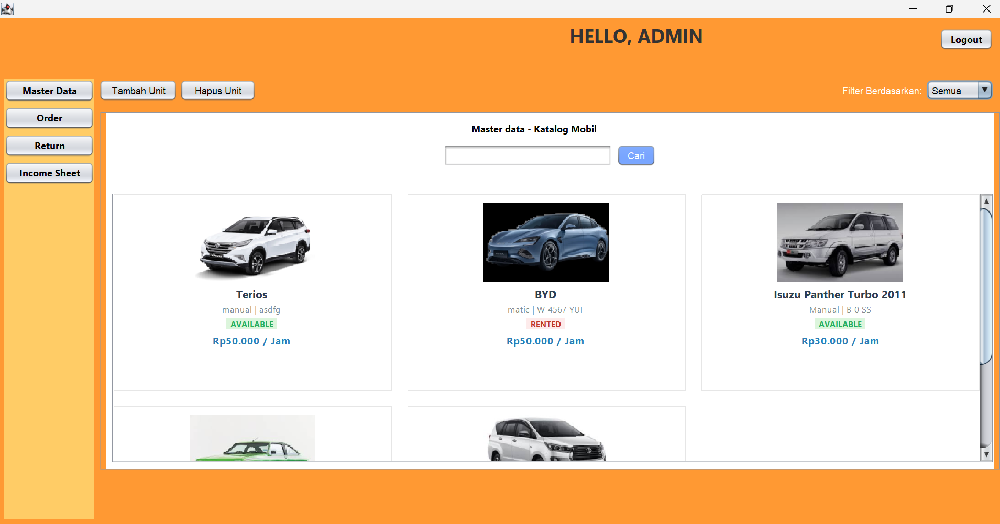

---

### 5.4 Masterdata (Katalog Mobil Admin)

**Langkah-langkah:**
1. Klik menu **"Masterdata"** di sidebar.
2. Sistem akan memuat seluruh data mobil dari database dan menampilkannya dalam format **kartu visual (grid layout)**.
3. Setiap kartu menampilkan: Foto mobil, Merk, Plat Nomor, Harga Sewa, dan Status.
4. Gunakan **kolom pencarian** di atas untuk memfilter mobil berdasarkan merk/nama.

---

### 5.5 Tambah Unit Mobil Baru

**Langkah-langkah:**
1. Klik menu **"Tambah Unit"** di sidebar.
2. Isi formulir:
   - **Merk Mobil** — Contoh: "Toyota Avanza".
   - **Plat Nomor** — Contoh: "B 1234 CD".
   - **Transmisi** — Pilih Manual atau Automatic.
   - **Kapasitas Kursi** — Jumlah seat.
   - **Harga Sewa Per Jam** — Angka saja (contoh: 50000).
3. (Opsional) Klik tombol **"Pilih Foto"** untuk mengunggah gambar mobil.
   - Foto akan otomatis disalin ke folder penyimpanan Laravel (`storage/app/public/cars/`).
4. Klik tombol **"Tambah Unit"**.
5. Jika berhasil, muncul popup *"Unit berhasil ditambahkan!"* dan form dikosongkan.

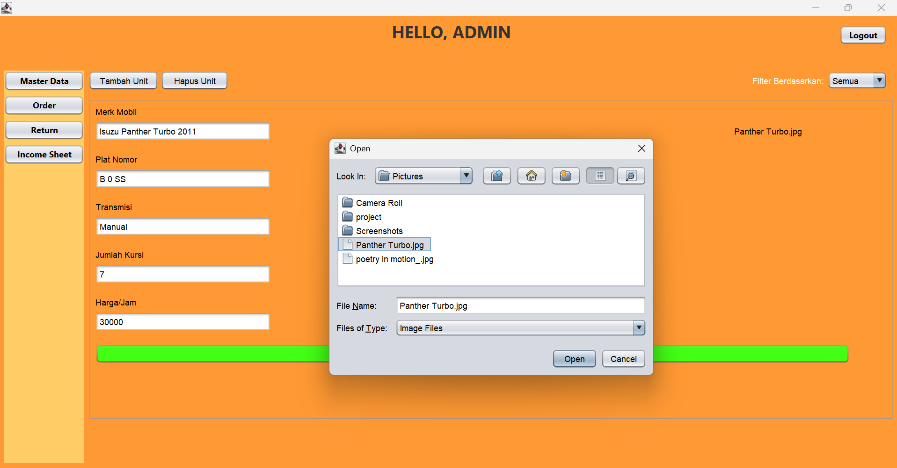
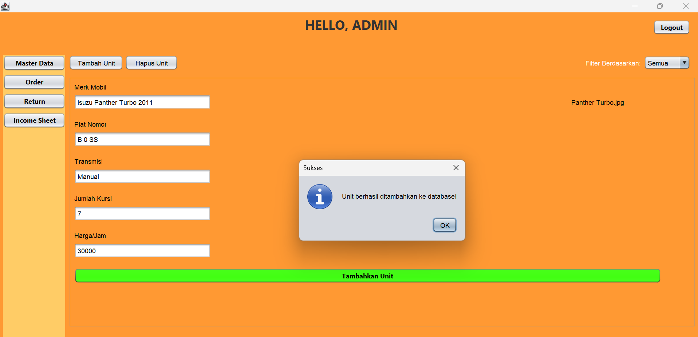

> **Penting:** Jika memasukkan harga berisi huruf (bukan angka), sistem akan menolak dengan pesan *"Harga tidak valid!"*.

---

### 5.6 Hapus Unit Mobil

**Langkah-langkah:**
1. Klik menu **"Hapus Unit"** di sidebar.
2. Cari mobil yang ingin dihapus menggunakan **kolom pencarian** (berdasarkan ID, Plat, atau Merk).
3. Pilih unit mobil yang muncul dari hasil pencarian.
4. Klik tombol **"Hapus"**.
5. Sistem akan **memeriksa status unit**:
   - Jika status `'available'` → Unit dihapus dari database.
   - Jika status `'rented'` → Penghapusan **DITOLAK** dengan pesan *"Gagal! Unit ini sedang aktif disewa oleh customer!"*.

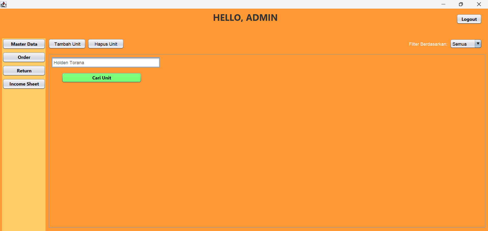
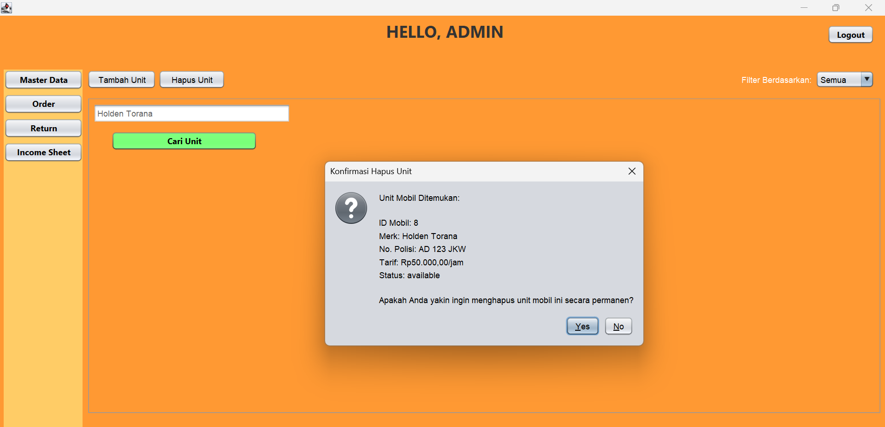

---

### 5.7 Konfirmasi Order Sewa Masuk

**Langkah-langkah:**
1. Klik menu **"Order"** di sidebar.
2. Daftar pesanan sewa masuk dari website customer akan ditampilkan.
3. Pilih satu pesanan untuk melihat detailnya (data customer, mobil yang dipesan, durasi sewa).
4. Periksa kelengkapan dokumen customer: **NIK**, **Alamat**, dan **Foto KTP**.
5. **Untuk mengonfirmasi pesanan:**
   - Klik tombol **"Konfirmasi"**.
   - Sistem menjalankan **ACID Transaction** (atomic):
     - Status rental → `'active'`
     - Status mobil → `'rented'`
     - Transaksi baru tipe `'Sewa Baru'` dicatat di database.
   - Muncul popup sukses.
6. **Untuk menolak pesanan:**
   - Klik tombol **"Tolak"**.
   - Masukkan alasan penolakan.
   - Status rental → `'rejected'`, alasan tersimpan di kolom `rejection_reason`.

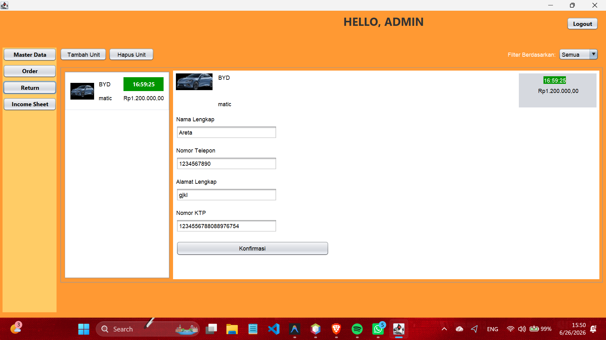
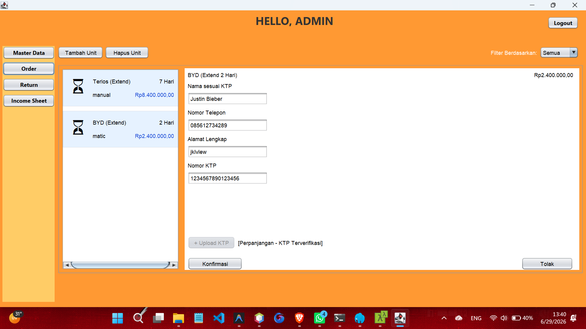

---

### 5.8 Pengembalian Mobil & Verifikasi Denda

**Langkah-langkah:**
1. Klik menu **"Return"** di sidebar.
2. Daftar sewa aktif ditampilkan dengan **countdown timer real-time** untuk setiap rental:
   - **Warna hijau/putih** → Masih dalam waktu sewa (tepat waktu).
   - **Warna merah** → Waktu sewa sudah habis (terlambat/overdue), otomatis ditambahkan biaya **denda**.
3. Pilih sewa yang ingin dikembalikan.
4. Klik tombol **"Konfirmasi Pengembalian"**.
5. Jika **terlambat**:
   - Sistem menampilkan nominal denda yang harus dibayar.
   - Pilih **"Yes"** untuk mencatat bahwa denda sudah dibayar.
   - Sistem menjalankan ACID Transaction:
     - Status rental → `'completed'`
     - Status denda → `'paid'`
     - Status mobil → `'available'`
     - Transaksi tipe `'Denda'` dicatat di database.

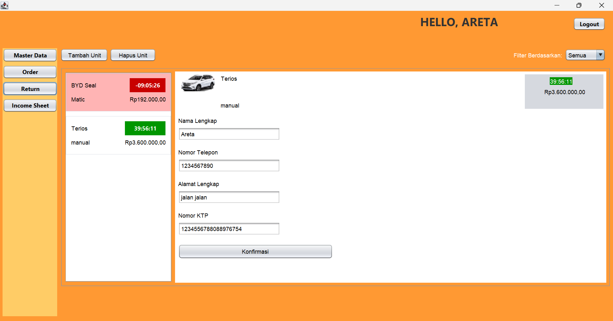

---

### 5.9 Laporan Pemasukan (Income)

**Langkah-langkah:**
1. Klik menu **"Income"** di sidebar.
2. Tabel pemasukan ditampilkan dengan kolom:
   - **ID Transaksi**, **Jenis** (Sewa Baru/Perpanjangan/Denda), **Tanggal**, **Nominal** (format Rupiah).
3. **Untuk melihat detail invoice**: Klik ganda (double-click) pada salah satu baris transaksi.
4. Jendela pop-up **Invoice** akan terbuka menampilkan:
   - Data customer (Nama, Email, Telepon).
   - Data mobil (Merk, Plat Nomor).
   - Rincian waktu sewa (Mulai → Selesai).
   - Total tagihan.
5. Tutup pop-up invoice dengan mengeklik tombol **"Tutup"** atau tombol X.

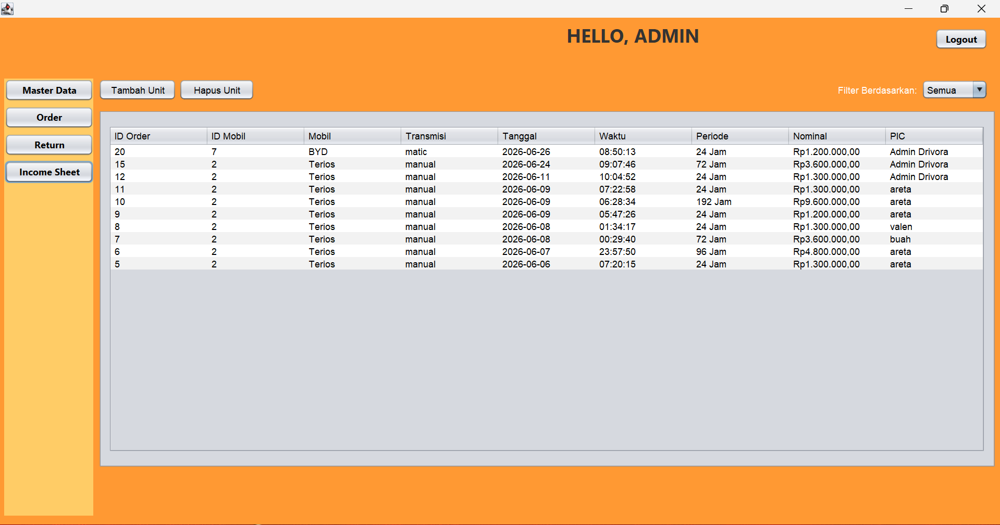
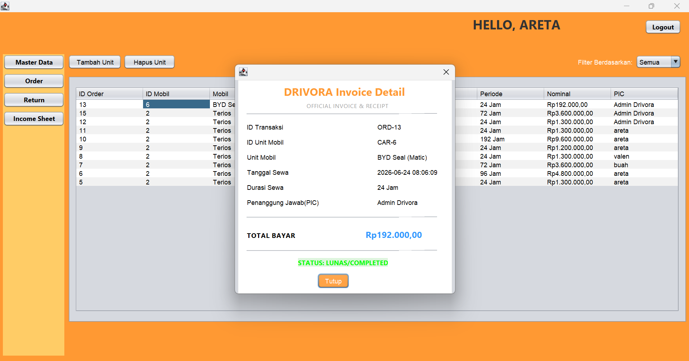

---

## 6. ALUR INTEGRASI WEB ↔ DESKTOP

Berikut adalah alur kerja lengkap dari awal hingga akhir yang menghubungkan kedua aplikasi:

```
 CUSTOMER (Web Laravel)                    ADMIN (Java Swing Desktop)
 ══════════════════════                    ══════════════════════════
 1. Register & Login                       
 2. Pilih Mobil di Katalog                 
 3. Isi Form Pemesanan                     
 4. Bayar Sewa                            
    ↓                                      
    Status: PENDING ──────────────────────► 5. Lihat Order Masuk
                                           6. Periksa Dokumen (NIK, KTP)
                                           7. Konfirmasi / Tolak Order
    ↓                                         ↓
    Status: ACTIVE ◄──────────────────────── Status mobil: RENTED
    ↓                                      
 8. Countdown Timer Berjalan               
 9. (Opsional) Perpanjang Sewa             
    ↓                                      
    Waktu Habis                            
    ↓                                      
    Status: OVERDUE ──────────────────────► 10. Lihat di Menu Return
                                           11. Proses Pengembalian
                                           12. Verifikasi Denda (jika ada)
    ↓                                         ↓
    Status: COMPLETED ◄─────────────────── Status mobil: AVAILABLE
                                           13. Lihat Laporan Income
                                           14. Cetak Invoice
```

### Ringkasan Status Transisi:
| Status | Arti | Ditrigger Oleh |
|--------|------|----------------|
| `pending` | Pesanan baru menunggu konfirmasi | Customer submit form sewa |
| `active` | Sewa sedang berjalan | Admin konfirmasi order |
| `rejected` | Pesanan ditolak admin | Admin tolak order |
| `overdue` | Waktu sewa habis, belum dikembalikan | Sistem otomatis |
| `completed` | Sewa selesai, mobil dikembalikan | Admin proses pengembalian |

---

*Dokumen ini dibuat sebagai panduan pengguna resmi untuk keperluan UAS sistem Drivora Rental.*
